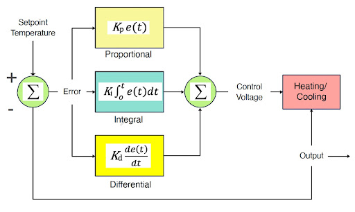
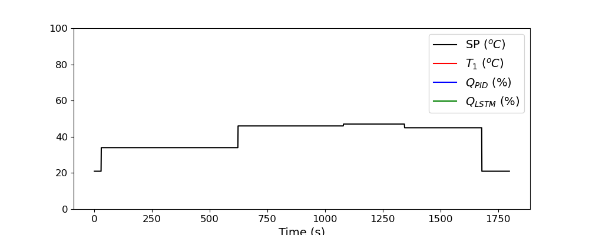

# Room Temperature Control emulating PID control using LSTM.

## CS 539 Machine Learning Project

- Tuning parameters of Kp Ki Kd is exhuastive and non trivial so we train a LSTM model so that we can emulate PID and completely and replace it 

- Following is loss trend of training LSTM

- Here is the predictions of LSTM controller values compared to that of PID heater values

